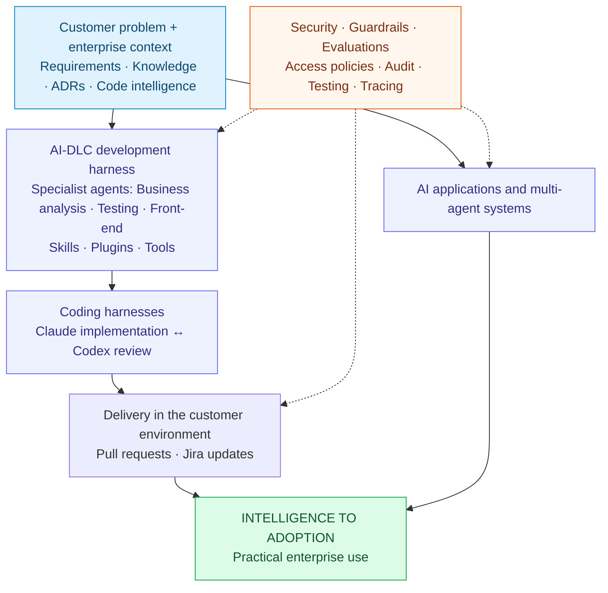

# Arup Kumar Sarkar

### AI Platform & Solution Architect

**Intelligence to Adoption**

I architect AI applications and multi-agent systems, and help engineering teams adopt AI effectively. At GlobalLogic, I build custom
Claude/Codex development environments, AI-DLC development harness, context, skills, plugins
and tools that connect AI agents to customer problems and delivery workflows.

**Enterprise AI adoption · AI-native software engineering · Context engineering · Security, guardrails & evals**

**20 years in software · 10 years in architecture**

[LinkedIn](https://www.linkedin.com/in/arupmmi/) · [Email](mailto:arupus07@gmail.com) · [Skynet Harness](https://github.com/i-skynetai/skynet-harness) · [Skygraph](https://github.com/i-skynetai/skygraph)

---

## Intelligence to Adoption — my architecture focus

A conceptual view of how my main areas connect, illustrated through ongoing personal projects.

## Enterprise AI adoption and developer enablement

I am a Solution Architect at GlobalLogic in Richardson, Texas. My current focus is
the engineering environment around AI: how teams give an agent the right context,
connect it to tools and workflows, control its actions and check its work.

I build an enterprise AI-DLC development harness over specialist Claude/Codex coding
harnesses. Used by our engineering team, it combines enterprise context, business
requirements, ADRs and code intelligence with specialist agents for business analysis,
testing and front-end development. A developer agent takes a Jira task, gathers
context, delegates implementation to Claude and review to Codex, coordinates
feedback, raises a PR and updates Jira. Custom environments, skills, plugins and
tools help organisational and client teams apply AI to their own systems.

My context platforms connect enterprise knowledge and code through graph, keyword
and vector retrieval and repository structure over MCP. An AI-SDLC platform I built
is used by three enterprise clients of a European enterprise ITSM SaaS vendor.

Security, guardrails and evaluations are part of the solution. My agent tooling
includes identity, default-deny policies, tool-call audit records and human approval
of outward actions. Testing and review check generated code and agent outputs;
cost tracking and tracing help diagnose runs and failures.

## Career progression — research, architecture and enterprise AI

- **GlobalLogic USA · Aug 2025–present:** AI Platform solution architecture, enterprise
  context, AI applications, multi-agent systems and the development harness.
- **GlobalLogic India · Apr 2021–Aug 2025:** full-stack architecture for a medical
  eyecare platform, solution and migration architecture, and the enterprise ITSM
  engagement from 2024 that continued in the USA.
- **DMI Innovation Lab · Oct 2019–Feb 2021:** product solution architecture and
  client-focused NLP/model training for recognising patterns in data and prediction.
- **Capgemini · Jun 2016–Oct 2019:** enterprise architecture alongside research-practice
  work with TensorFlow, model building, training and prediction.

## Full-stack engineering foundation

This work rests on 20 years in software, including ten in architecture. I remain
hands-on with Python/FastAPI, React/TypeScript, microservices and distributed systems.
Within a multi-tenant SaaS platform, my architecture and implementation contributions
cover the application shell, selected micro-frontends, shared libraries and AI work
within the wider platform design.

My agentic ITSM work connects shared context to ticket, incident and problem analysis,
impacted-service discovery and business-impact reasoning. This is distinct from the
AI-DLC work supporting engineering teams.

## What I work on

| Area | Engineering focus |
|---|---|
| **Enterprise AI enablement** | Custom Claude/Codex development environments, developer enablement and customer workflow integration |
| **AI-enabled software engineering** | AI-DLC development harness, agent skills and plugins, tool integration, context over MCP, testing and review |
| **Solution architecture** | Requirements analysis, solution design, architecture decisions, service boundaries, API contracts and enterprise integration |
| **Full-stack platforms** | Multi-tenant SaaS, Python/FastAPI microservices, React/TypeScript micro-frontends, Module Federation and shared libraries |
| **Delivery** | CI/CD, containerisation, observability, design reviews and technical guidance across distributed teams |
| **AI & retrieval** | RAG, knowledge graphs, hybrid graph/keyword/vector search, grounded agent workflows and context engineering |
| **Agentic business applications** | Shared context for ticket, incident and problem analysis, impacted-service discovery and business-impact reporting |
| **AI security** | Agent identity, role policies, tool-call audit trails, human approval, tenant isolation and access control |
| **Evaluation & operations** | LLM evaluation, output verification, cost tracking, timings, tracing and failure diagnosis |
| **Code intelligence** | Syntax trees, symbols, call graphs and incremental repository context |

## How I work

- **Start with the requirement.** Connect the business need to a design teams can build, operate and extend.
- **Make decisions explicit.** Define contracts, constraints and architecture decisions so teams can work independently.
- **Give AI useful context.** Supply the relevant files, decisions and constraints, then verify the result through tests and review.

## Intelligence to Adoption — concepts demonstrated through ongoing projects

At GlobalLogic, I build context engines, AI-DLC development harness and custom development
environments around Claude/Codex to help teams use AI effectively in customer
workflows. The projects below are personal, ongoing examples of the architectural
ideas behind that work. They show how I think about context, agent tooling,
orchestration, security, guardrails and evaluations.

These examples are intended to make my approach tangible for recruiters and
engineering teams. They are evolving demonstrations, rather than final commercial
products, and contain no employer or client implementation.

| Example project | Concept it demonstrates | Connection to my professional focus |
|---|---|---|
| [Skygraph](https://github.com/i-skynetai/skygraph) | Repository structure and code relationships exposed through MCP | Context engineering that helps coding agents work within an existing codebase |
| [Skynet Harness](https://github.com/i-skynetai/skynet-harness) | Roles, policies, skills, tool access, audit records and human checkpoints | Custom development environments for controlled use of AI coding agents |
| [Ethan](https://github.com/i-skynetai/ethan) | Routing a request to relevant knowledge and specialist tools | Connecting context and agents to a practical workflow |
| [Skynet+](https://github.com/i-skynetai/sky-plus) | Configurable agent runtime, memory, guardrails, evaluation and tracing | Reusable infrastructure around AI applications |
| [Praxis](https://github.com/i-skynetai/praxis) | Typed capabilities, calibration, model routing and fallback | Evaluation-led design for applying models to specific tasks |

Together, these examples illustrate **Intelligence to Adoption**: building the
engineering environment around AI so it can be applied effectively. My professional
experience provides the enterprise delivery evidence; this portfolio gives a public
view of related ideas and design choices.

Explore the repositories for code, diagrams, examples and ongoing development.

## Tools I use

**Applications:** Python · FastAPI · PostgreSQL · React · TypeScript · Module Federation  
**Delivery:** Docker · GitHub Actions · Azure Pipelines · OpenTelemetry  
**AI & knowledge:** RAG · GraphRAG · MCP · Neo4j · Elasticsearch/OpenSearch · LLM evaluation  
**Security:** role-based access control · tenant isolation · audit trails · agent identity · guardrails

## Let's connect

I welcome conversations about AI platform and solution architecture, context engineering,
enterprise AI enablement and secure agent workflows, with hands-on software delivery.
Available for international relocation; employer visa sponsorship required.

[Connect on LinkedIn](https://www.linkedin.com/in/arupmmi/) or
[email me](mailto:arupus07@gmail.com).